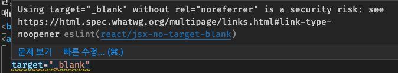
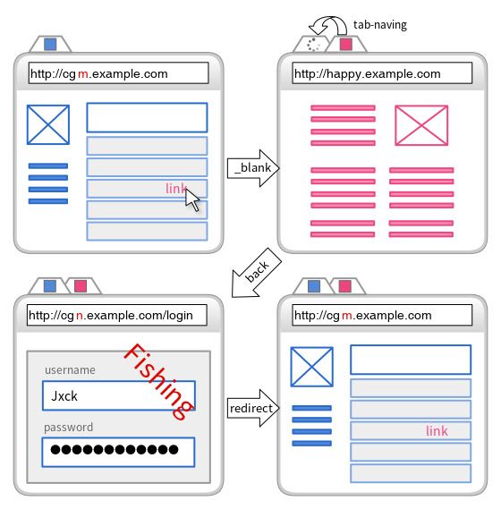
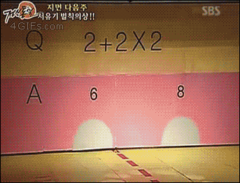
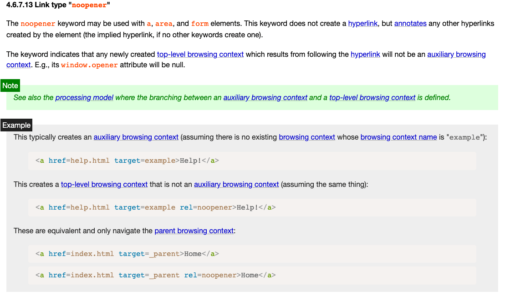
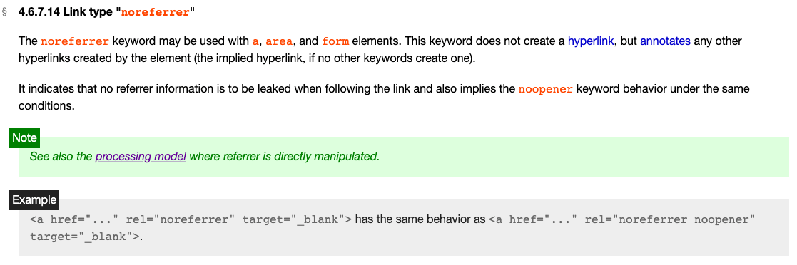
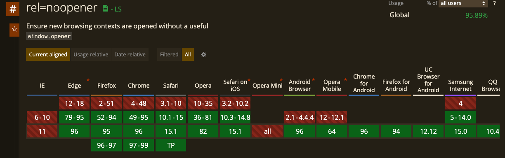

## 문제 발견

eslint가 설정된 jsx파일에서 `a태그`에 `target=”_blank”` 속성을 주게되면 [react/jsx-no-target-blank](https://github.com/yannickcr/eslint-plugin-react/blob/master/docs/rules/jsx-no-target-blank.md) 경고를 보게된다. 



경고 내용을 살펴보면 `target=”_blank”` 속성이 있을 경우, `rel=”noreferrer”` 속성을 추가하지 않으면 보안 문제(security risk)가 생길 수 있다고 알려준다. 

응? 어떤 보안 문제일까 궁금해졌다.

## 1. target=”_blank” 의 동작 방식

`target` 속성에 `“_blank”` 값이 있는 a태그의 경우 새로운 탭에서 페이지가 열린다. 이 때 a태그가 있는 기존 페이지를 `parent`, 링크로 인해 새롭게 열린 페이지는 `child`라고 하자. 이 때 `child`에서 `window.opener` 속성으로 `parent`를 컨트롤 할 수 있다. 

```jsx
// child에서 사용되는 js파일
window.opener.location = "https://coupamg.com";
```

위 코드로 사용자가 눈치채지 못하게 parent 페이지를 다른 도메인으로 유도 할 수 있다. 

## 2. Tab nabbing 기술

위에서 알아본 `child`에서 `parent`를 조작할 수 있는 기술을 피싱 사기에 사용할 수 있다. 이 수법이 Tab nabbing 기술이다.


### 공격 원리



`https://cgm.example.com` 이라는 서비스 페이지가 있다고 가정하자. 해커는 불특정 사용자의 username과 password를 가로채려고 한다. 그러기위해 해커는 서비스의 게시물에 특정 링크(해커가 만든 페이크 페이지로 이동)를 게시한다. 이 때 전제는 링크(a태그)가 `target="_blank"` 로 마크업 되어있어야 한다.

### 공격 시나리오

1. 사용자는 `https://cgm.example.com` 에 접속 ⇒ `(parent 페이지)`
2. 서비스를 이용하던 중, 해커가 올린 게시물에서 `https://happy.example.com`로 이동하는 링크를 클릭
3. 해당 사이트는 새 탭으로 페이지가 열림 ⇒ `(child 페이지)`
    1.  이 페이지(`happy.example.com`)는 해커가 만든 페이지로, 이 페이지의 스크립트에서 `parent`의 url을 `cgn.example.com/login` 으로 변경 ⇒ 이 페이지 역시 해커가 만든 fake페이지
4. 사용자는 child 페이지 탐색을 마치고, 기존 parent페이지로 돌아옴, 하지만 해커가 교묘하게 변경한 주소로 이동되어 있음 (`cgm.example.com` vs `cgn.example.com`)
5. 사용자는 서비스에서 로그아웃 되었다고 생각하고, 다시 로그인 시도
6. 입력된 계정 정보는 해커에게 전달 (추가로 원래 서비스로 리다이렉트 시켜 로그인 된 것처럼 느끼게 함)


### **피싱 공격인 것을 알아차기 위해서는..?**

- 기존 탭의 url이 변경되고 있음을 감지해야 한다 → 기존 탭의 탭 아이콘이 로딩되는지 주시
- parent 페이지가 로그아웃 된 것에 의심을 품는다.
- 브라우저 로그인 자동완성이 실행되지 않았다는 것을 깨닫는다.
- 도메인이 미묘하게 다르다는 것을 파악한다. (naver.com ↔ naverr.com)




두뇌 풀가동해서 위 사항들을 모두 인지하고 항상 의심하면서 웹서비스를 이용하자.. 

⇒ 나도 인식하지 하지 못하고(?) 피싱에 걸렸을 듯?... 🥺

## 3. noreferrer, noopner 속성

`tabnabbing`을 방지할 수 있는 방법이 `rel="noreferrer"` 혹은 `rel="noopener"`속성을 적용하는 것이다. 

### a. `rel="noopener"`



`[rel="noopener"](https://html.spec.whatwg.org/#link-type-noopener)` 속성을 추가하면 child에서 `window.opener`를 통해 기존 탭(parent)를 참조할 수 없게 된다. 그렇기 때문에 기존 탭(parent)의 location을 변경하는 등의 조작을 방지할 수 있다.

### b. `rel="noreferrer"`



`rel="noopener"` 와 유사하게 새로 열린 탭의 페이지에서 `window.open`를 통해 기존 탭을 참조 할 수 없게 한다. `noopener`가 있는데 이 속성을 사용한 이유는 이전에는 Chorme, Opera 이외에 다른 브라우저가 `noopener` 속성을 지원하지 않아, 지원 범위가 상대적으로 더 넓은 `referer`을 사용한 걸로 추측된다. (두 속성을 깊게 digging하여 차이점을 파악해야 하지만 이번 TIL에서는 여기까지만...⭐️)

### c. 그렇다면 둘 중 어떤 속성을 사용할까?

이전에는 브라우저 지원 범위가 `noopener` 속성에 제약이 있어, 지원 범위가 상대적으로 더 넓은 `noreferrer` 속성을 사용했지만, 최근에는 대다수 브라우저가 두 속성 모두 지원하고 있다.



noopner 속성 브라우저 지원 범위


noreferrer 속성 브라우저 지원 범위

불안하다면 두 속성 모두 사용하는 방법이 주로 쓰인다. (개인적으로는 `noreferrer` 속성만 사용하여도 무방할 것 같다고 생각)

### **정리**

- `target="_blank"` 쓸 경우, `tabnabbing` 공격 문제가 생길 수 있음.
- 링크로 오픈되는 child 페이지가 같은 도메인이라면 공격 가능성이 없으니 대응할 필요가 없음.
- 해당 공격을 대비하기 위해 a태그에 `rel="noopener noreferrer"` 속성 추가하자.
- `target="_blank"` 가 아니라면 해당 속성(`noopner`, `noreferrer`)을 줄 필요가 없음


