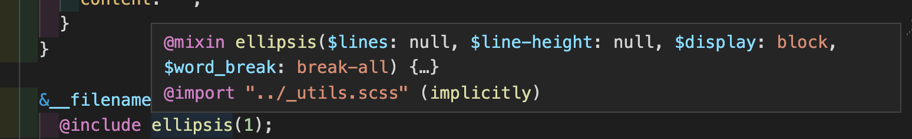
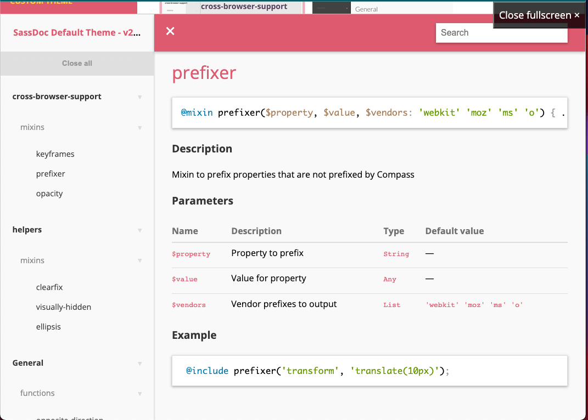

## 목적

---

scss를 사용하는 프로젝트에서 원활한 작업을 위해 `mixin`을 추가하는 작업을 진행하였습니다.

이 과정에서 아래 기능들을 조사하였고, 공유하고자 합니다.

1. jsDoc처럼 mixin에 주석 추가
2. 해당 mixin을 include하여 사용할 때, auto complete나 help 툴팁 활성화
3. 여러 mixin, variable 등을 Document 형태로 서빙해주는 모듈

---

### 기존에 개발된 모듈 및 extention 소개

---

1. 아래 vscode extention을 사용하면 mixin에 JSDoc처럼 주석을 남길 수 있습니다. 
    - [vscode-sassdoc](./images/sassdoc%EC%A3%BC%EC%84%9D.png)
        
        
        
        - sass 주석 생성 스니펫 vscode extension
        - 사용법:
            1. scss 파일 내 mixin 선택
            2. `command + shift + p`
            3. `> Add SassDoc` 
            
            
            
        - 참고: [scss에서 사용되는 자료형 정리 Document](https://sass-lang.com/documentation/values)
 
 
2. vsCode extension을 사용하면 **자동 완성**이나 **툴팁 help** 을 볼 수 있습니다. 
    - [SCSS IntelliSense](https://marketplace.visualstudio.com/items?itemName=mrmlnc.vscode-scss)
        
        
        
        - minxin, variable 자동 완성 및 툴팁 표현 도와주는 vscode extension
 
 
3. 믹스인, 변수 등 설명이 필요한 코드가 많아질 경우 [sassDoc](http://sassdoc.com/theme-gallery/)을 도입하면 스토리북처럼 별도 doc페이지를 서빙 할 수 있습니다
    
    
    

## 참고 링크

---

- vscode-sassdoc: [https://marketplace.visualstudio.com/items?itemName=rafikis75.vscode-sassdoc](https://marketplace.visualstudio.com/items?itemName=rafikis75.vscode-sassdoc)
- SCSS intelliSense: [https://marketplace.visualstudio.com/items?itemName=mrmlnc.vscode-scss](https://marketplace.visualstudio.com/items?itemName=mrmlnc.vscode-scss)
- scssDoc 서빙 페이지 예시: [http://sassdoc.com/theme-gallery/](http://sassdoc.com/theme-gallery/)