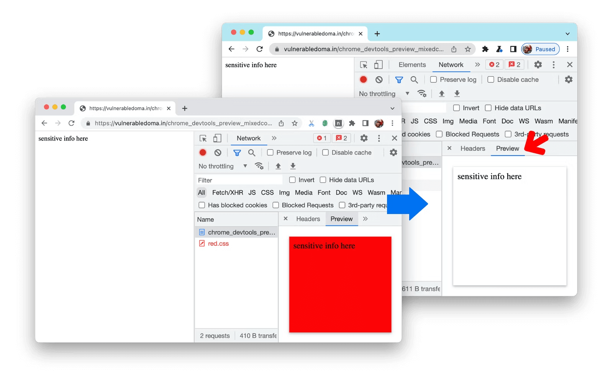
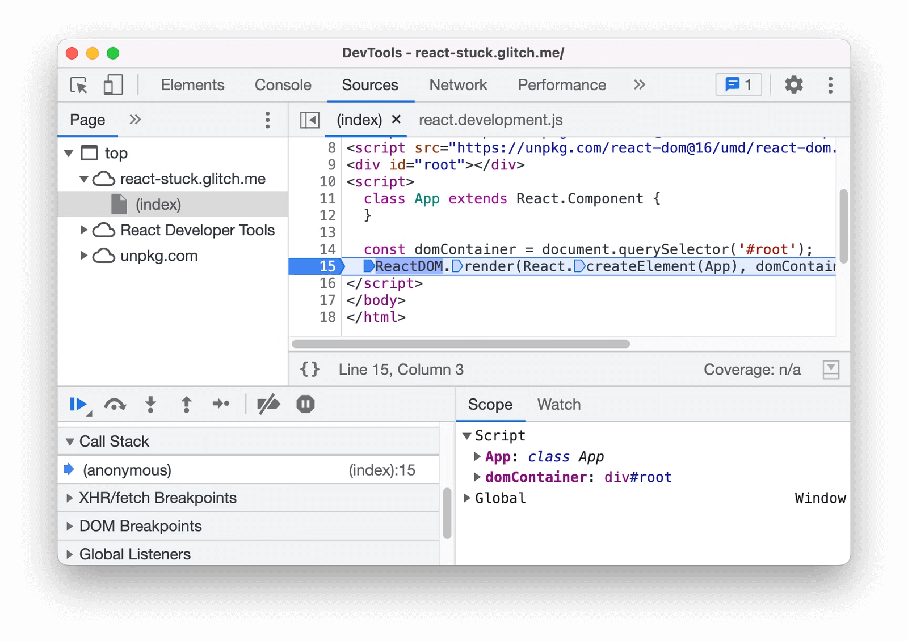
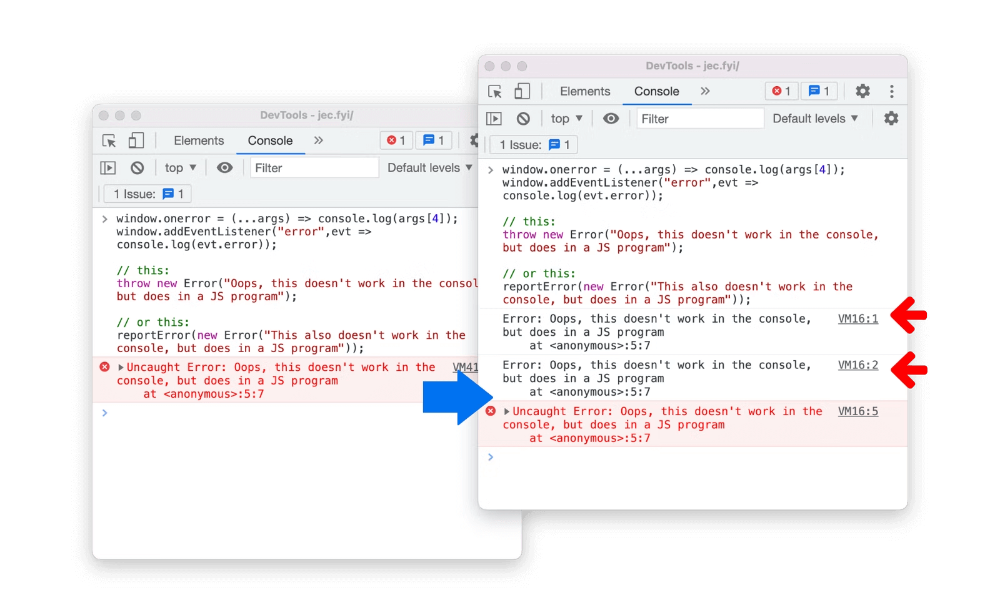
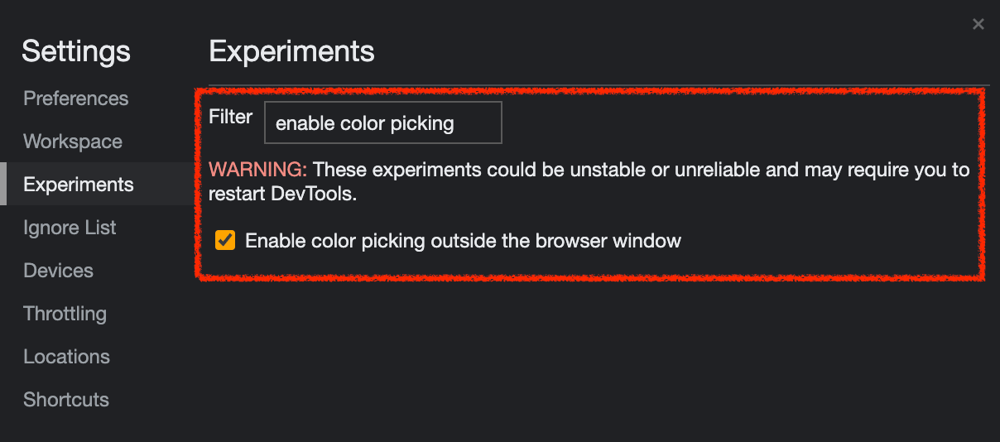
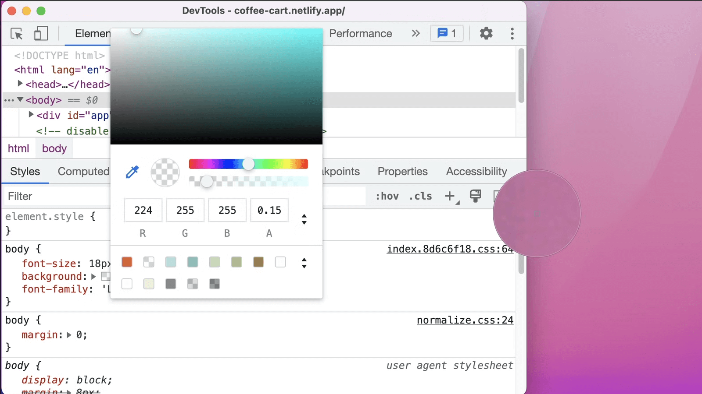

2022년 6월 10일 정식 릴리즈 된 Chrome 102의 `features` 와 `dev tools` 에 관한 내용을 정리합니다. 도움이 될만한 내용이라고 생각되는 부분을 주관적으로 선별하여 추가해보았습니다. 전체 내용 및 원본 내용이 궁금하신 부분은 아래 링크를 참고하시면 됩니다.

## 🙏🏻 참고

- [Chrome 102 - What’s New in DevTools](https://www.youtube.com/watch?v=0V_ph7PA_aw)
- [https://chromestatus.com/features#milestone%3D102](https://chromestatus.com/features#milestone%3D102)
- [https://developer.chrome.com/blog/new-in-devtools-102/](https://developer.chrome.com/blog/new-in-devtools-102/)

---

## 🧑🏻‍💻 목차

### ⚡️ Features

- **[HTML] inert attribute 추가**

### ⚒️ DevTools

- **New Performance insights panel**
- **New shortcuts to emulate light and dark themes**
- **Improved security on the Network Preview tab**
- **Improved reloading at breakpoint**
- **Console updates**
- **Commit live expression with Enter**
- **Display inherited highlight pseudo-elements in the Styles pane**
- **[Experimental] Picking color outside of browser**

---

# ⚡️ FEATURES

## [HTML] **inert attribute 추가**

inert 속성은 DOM 트리의 일부를 비활성으로 표시할 수 있게 한다. 아래와 같은 같은 기능을 합니다.

```html
<div inert>비활성 상태가 필요한 DOM</div>
```

- `pointer-events` CSS 속성이 'none'으로 설정된 것처럼 동작해야 한다.
- 텍스트 선택 기능은 `user-select` CSS 속성이 'none'으로 설정된 것처럼 동작해야 합니다.
- 편집할 수 있는 경우 노드는 편집할 수 없는 것처럼 동작합니다.

<br>

또한, 기능 뿐만 아니라 접근성 측면에서도 비활성 상태로 만들어 줍니다. 아래 아티클에서 잘 정리되어 있어 참고하시면 이해에 도움이 됩니다.

- Toast UI: [https://ui.toast.com/posts/ko_20220603](https://ui.toast.com/posts/ko_20220603)
- Intoducing Inert: [https://developer.chrome.com/articles/inert/](https://developer.chrome.com/articles/inert/)

---

# ⚒️ DEV TOOLS

## **New Performance insights panel**

`Performance insights`를 사용하여 웹 사이트의 성능에 대한 실행 가능하고 사용 사례 중심의 인사이트를 얻을 수 있습니다. 위 튜토리얼의 [비디오 버전](https://www.youtube.com/watch?v=0V_ph7PA_aw)을 시청하세요.

예를 들어, 다음 [데모 페이지](https://coffee-cart.netlify.app/?ad=1)의 페이지 로딩을 **Performance insights**로 측정해보세요.


녹화가 완료되면 Insights 창에서 성능 인사이트들을 얻을 수 있습니다. 각 인사이트 항목(ex: Render block request, layout shift)들을 클릭하여 문제 및 잠재적인 수정 사항을 파악할 수 있습니다.

### 기존 Performance 패널의 문제점


- 정보가 너무 많고, actionable 하지 않다.
- 브라우저를 더 효과적으로 사용하기 위해 브라우저가 어떻게 동작하는지 더 깊게 알아야한다 → insight에서 브라우저 동작에 관해 설명, 개선방향을 자동으로 추천

Chromium issue: [1270700](https://crbug.com/1270700)

## **New shortcuts to emulate light and dark themes**

Styles pane에 새로운 단축 ui를 이용하면 라이트/다크 테마를 더 빨리 계산할 수 있습니다(CSS media feature [prefers-color-scheme](https://web.dev/prefers-color-scheme/#the-prefers-color-scheme-media-query))


이전에는 Rendering tab에서 테마를 계산하기 위해 더 많은 단계가 필요했습니다.


Chromium issue: [1314299](https://crbug.com/1314299)

## **Improved security on the Network Preview tab**

DevTools의 Preview 탭에 Network 패널은 현재 Content Security Policy (CSP) 정책을 적용하고 있습니다.

예를 들어, 첫번째 스크린샷은 [mixed content](https://web.dev/what-is-mixed-content/)를 포함하는 있는 페이지를 보여줍니다.

> 💡 **mixed content(혼합 콘텐츠)란?**
> mixed content는 초기 HTML이 보안 HTTPS 연결을 통해 로드되지만 다른 리소스(예: 이미지, 비디오, 스타일시트, 스크립트)는 HTTP 연결을 통해 로드될 때 발생합니다. HTTP 및 HTTPS 콘텐츠가 모두 동일한 페이지를 표시하기 위해 로드되고 초기 요청이 HTTPS를 통해 안전했기 때문에 이를 혼합 콘텐츠라고 합니다.


페이지는 보안 HTTPS 연결을 통해 로드되지만 스타일시트는 보안되지 않은 HTTP 연결을 통해 로드됩니다. 브라우저가 기본적으로 스타일시트 요청을 차단합니다. 그러나 Network 패널의 Preview 탭을 통해 페이지를 열었을 때 경우는 스타일시트가 차단되지 않았습니다. 이제 Preview 탭에서도 차단되게 됩니다.



## **Improved reloading at breakpoint**

이제 breakpoint에서 다시 로드할 때 디버거가 스크립트 실행을 종료합니다.

이전에 [React demo](https://react-stuck.glitch.me/)에서 ReactDOM에 breakpoint를 설정하고 다시 로드할 때 무한 루프가 발생했습니다. 무한 루프 때문에 **Source 패널**은 멈추게 됩니다. JavaScript를 계속 실행하면 개발자에게 많은 문제가 발생하며 렌더러를 고장난 상태로 만들 수 있습니다.



Chromium issues: [1014415](https://crbug.com/1014415), [1004038](https://crbug.com/1004038), [1112863](https://crbug.com/1112863), [1134899](https://crbug.com/1134899)

## **Console updates**

### **Handle script execution errors in the Console**

이제 크롬 Console 환경에서 script를 실행시 발생한 error가 `window.onerror` 핸들러에 적절한 error 이벤트를 발생시킵니다. 그리고 이 이벤트들은 window 객체에 `“error”` 이벤트로 dispatch 됩니다.



Chromium issue: [1295750](https://crbug.com/1295750)

### Commit live expression with Enter

live expression 타이핑을 마친 다음에 `Enter` 를 눌렀을 때. 이전에는 개행처리되었지만 이제 DevTools에서 지속적으로 실행됩니다. 만약 개행처리하고 싶다면 **live expression** 에디터에서, `Shift` + `Enter`


Chromium issue: [1260744](https://crbug.com/1260744)

## **Display inherited highlight pseudo-elements in the Styles pane**

이제 **Styles** 창에서 상속된 highlight pseudo-elements (e.g. `::selection`, `::spelling-error`, `::grammar-error`, `::highlight`)를 볼 수 있습니다. 이전에는 이 규칙들이 표시되지 않았습니다.


Chromium issue: [1024156](https://crbug.com/1024156)

## **[Experimental] Picking color outside of browser**

<aside>
💡 이 기능을 가능하게 하려면, **Settings** > **Experiments의 Enable color picking outside the browser window 설정을 활성화해야 합니다.**

</aside>



이전에는 브라우저 안에서의 컬러만 선택 할 수 있었지만, 이제 브라우저 바깥 영역도 선택 가능합니다. Styles 영역의 color preview 클릭 > color picker 클릭합니다.

**번외: 색상코드 형식 변환하는 방법**

색상 코드를 `shift` + 클릭시 색 표현 형식이 변환됩니다. (ex: hex → hsl → rgb)



Chromium issue: [1245191](https://crbug.com/1245191)
