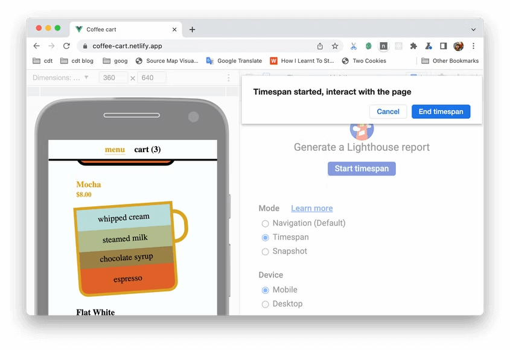

2022년 6월 21일 정식 릴리즈 된 Chrome 103의 `features`와 `dev tools`에 관한 내용을 정리합니다. 도움이 될만한 내용이라고 생각되는 부분을 주관적으로 선별하여 추가해보았습니다. 전체 내용 및 원본 내용이 궁금하신 부분은 아래 링크를 참고하시면 됩니다.

## 🙏🏻 참고

- [Chrome 103 - What’s New in DevTools](https://developer.chrome.com/blog/new-in-chrome-103/)
- [https://chromestatus.com/features#milestone%3D103](https://chromestatus.com/features#milestone%3D103)
- [https://developer.chrome.com/blog/new-in-devtools-103/](https://developer.chrome.com/blog/new-in-devtools-103/)

## 목차

### ⚡️ FEATURES

- **HTTP 103 status code 103 - early hints**
- **Local Font Access API**
- **Easier Timeouts with AbortSignal.timeout()**

### ⚒️ DevTools

- **Recorder 패널에서 더블 클릭 & 우 클릭 이벤트 캡쳐하기**
- **Lighthouse 패널에서 새로 출시된 timespan과 snapshot 모드**
- **디버깅 중 인라인 값 미리보기 개선**

---

# ⚡️ FEATURES

## 📡 **HTTP 103 status code 103 - early hints**

`resource hints`를 사용하면 페이지 성능을 향상시킬 수 있습니다. 이를 통해 브라우저에 나중에 어떤 것이 필요할지 "힌트"를 줍니다. 예를 들어, 파일을 미리 로드(preloading)하거나 다른 서버에 연결합니다.

```html
<link as="font" crossorigin="anonymous"
      href="..." rel="preload">
<link as="font" crossorigin="anonymous"
      href="..." rel="preload">
<link href="https://web-dev.imgix.net"
      rel="preconnect">
```

그러나 서버가 페이지의 적어도 일부를 전송하기 전에는 브라우저가 이러한 힌트에 대해 작업을 수행할 수 없습니다. 

브라우저가 페이지를 요청하지만 서버가 페이지를 생성하는 데 수백초가 소요된다고 상상해 보십시오. 브라우저가 페이지를 수신하기 시작할 때까지 기다리기만 하면 됩니다. 그러나 서버가 CSS 파일, 일부 자바스크립트, 몇 개의 이미지와 같은 특정 서브 리소스가 항상 필요하다는 것을 알고 있다면, 서버는 즉시 새로운 `HTTP 103 Early Hints` 상태 코드로 응답하고 브라우저에 이러한 서브 리소스를 미리 로드하도록 요청할 수 있습니다.

```html
<!DOCTYPE html>
<html>
<head>
  <link href="style.css" rel="stylesheet"> 
	<link rel="preload" href="main.js" as="script">
</head>
<body>
  <!-- ... (the server needs to "think" to generate the content) ... -->
</body>
</html>
```


그런 다음, 서버가 페이지를 생성하면, 정상적인 HTTP 200 응답으로 페이지를 전송할 수 있습니다. 페이지가 들어오면서 브라우저는 이미 필요한 리소스를 로드하기 시작했습니다.


AS-IS


TO-BE

새로운 HTTP 상태 코드이므로, 사용하려면 서버에 대한 업데이트가 필요합니다. ([Apache 2 Early Hints configuration](https://httpd.apache.org/docs/2.4/howto/http2.html#earlyhints))

### 참고

- [RFC 8297](https://datatracker.ietf.org/doc/html/rfc8297)
- [Explainer for Early Hints](https://github.com/bashi/early-hints-explainer/blob/main/explainer.md)
- [Apache 2 Early Hints configuration](https://httpd.apache.org/docs/2.4/howto/http2.html#earlyhints)
- [Using Early Hints on Cloudflare](https://developers.cloudflare.com/cache/about/early-hints/)
- [Fastly Beyond Server Push: The 103 Early Hints Status Code](https://www.fastly.com/blog/beyond-server-push-experimenting-with-the-103-early-hints-status-code)

## 🎨 Local Font Access API

웹에서 폰트는 항상 어려운 과제였고, 특히 사용자가 자신만의 그래픽과 디자인을 만들 수 있는 앱에게는 더욱 그러합니다. 지금까지 웹 앱은 웹폰트만 사용할 수 있었습니다. 사용자가 컴퓨터에 설치한 글꼴 목록을 가져올 방법이 없었습니다. 또한 커스텀 텍스트를 구현해야 하는 경우, 중요한 전체 폰트 테이블 데이터에 액세스할 수 있는 방법이 없었습니다. 

새로운 `Local Font Access API`는 웹 응용 프로그램에서 사용자의 장치에 있는 로컬 폰트를 열거할 수 있는 기능을 제공하고 폰트 테이블 데이터에 대한 액세스를 제공합니다.

디바이스에 설치된 폰트 목록을 가져오려면 먼저 사용 권한을 요청해야 합니다.

```jsx
// Ask for permission to use the API
try {
  const status = await navigator.permissions.request({
    name: 'local-fonts',
  });
  if (status.state !== 'granted') {
    throw new Error('No Permission.');
  }
} catch (err) {
  if (err.name !== 'TypeError') {
    throw err;
  }
}
```

그런 다음 `window.queryLocalFonts()`을 호출하면, 디바이스 로컬에 설치된  폰트 리스트를 반환합니다.

```jsx
const opts = {};
const pickedFonts = await self.queryLocalFonts();
for (const fontData of pickedFonts) {
  console.log(fontData.postscriptName);
  console.log(fontData.fullName);
  console.log(fontData.family);
  console.log(fontData.style);
}
```


현재 로컬에 설치된 폰트 리스트

폰트 중 특정 서브셋이 필요하다면, `postscriptNames` 파라미터를 추가하여 필터링 할 수 있다.

```jsx
const opts = {
  postscriptNames: [
    'Verdana',
    'Verdana-Bold',
    'Verdana-Italic',
  ],
};
const pickedFonts = await self.queryLocalFonts(opts);
```

더 자세한 설명이 필요하다면 web.dev에 Tom이 작성한 [Use advanced typography with local fonts](https://web.dev/local-fonts/) 아티클을 읽어보세요.

## 🕰 Easier Timeouts with AbortSignal.timeout()

JavaScript에서 AbortController와 AbortSignal은 비동기 호출을 취소하는 데 사용됩니다.

예를 들어 `fetch()` 요청을 할 때 `Abort Signal`을 생성하고 이를 `fetch()`에 전달할 수 있습니다. `fetch()`가 반환되기 전에 취소하려면 Abort Signal 인스턴스에서 `abort()`를 호출합니다. 지금까지 특정 시간 후에 중단하려면 `setTimeout()`으로 묶어야 합니다.

```jsx
const controller = new AbortController();
const signal = controller.signal;
const resp = fetch(url, { signal });

setTimeout(() => {
  // abort the fetch after 6 seconds
  controller.abort();
}, 6000);
```

다행히 `Abort Signal`의 새로운 `timeout()` 정적 메서드를 통해 이 작업이 쉬워졌습니다. 지정된 시간(밀리초) 후에 자동으로 중단되는 `AbortSignal` 개체를 반환합니다. 예전에는 몇 줄의 코드였지만 지금은 한 줄에 불과합니다.

```jsx
const signal = AbortSignal.timeout(6000);
const resp = fetch(url, { signal });
```

`[AbortSignal.timeout()](https://developer.mozilla.org/docs/Web/API/AbortSignal)`  Chrome 103 버전에서 지원합니다.

---

# ⚒️ DEV TOOLS

## 📹 **Recorder 패널에서 더블 클릭 & 우 클릭 이벤트 캡쳐하기**

**Recorder** 패널에서 더블 클릭 & 우 클릭 이벤트를 캡쳐할 수 있습니다.


다음 [예제](https://jec.fyi/demo/dbl-right-click) 에서, [recording](https://developer.chrome.com/ko/docs/devtools/recorder/#record) 을 시작하고 아래 스텝을 따라해보세요:

- 카드를 더블 클릭하면 확대됩니다.
- 카드를 우클릭하고 컨텍스트 메뉴에서 동작을 선택하세요.

**Recorder** 가 어떻게 이러한 이벤트를 캡쳐하는지 이해하려면, 다음 단계로 확장하세요:

- **더블 클릭** 은 `type: doubleClick` 으로 캡쳐됩니다.
- **우 클릭** 이벤트는 `type: click` 으로 캡쳐되지만 `button` 속성은 `secondary` 로 설정됩니다. 일반적인 마우스 클릭의 `button` 값은 `primary` 입니다.

Chromium issues: [1300839](https://crbug.com/1300839), [1322879](https://crbug.com/1322879), [1299701](https://crbug.com/1299701), [1323688](https://crbug.com/1323688)

## 🗼 **Lighthouse 패널에서 새로 출시된 timespan과 snapshot 모드**

이제 **Lighthouse** 에서 페이지 로딩 이상의 웹사이트 성능을 측정할 수 있습니다.


**Lighthouse** 패널은 이제 유저 플로우 측정을 위해 3가지 모드를 지원합니다.

- [Navigation](https://github.com/GoogleChrome/lighthouse/blob/master/docs/user-flows.md#navigation) 리포트는 단일 페이지 로딩을 측정합니다. Navigation은 가장 보편적인 보고 형태입니다. 이전 버전의 모든 Lighthouse 리포트는 navigation 리포트입니다.
- [Timespans](https://github.com/GoogleChrome/lighthouse/blob/master/docs/user-flows.md#timespan) 리포트는 일반적으로 유저 인터렉션을 포함한 임의의 기간을 분석합니다.
- [Snapshots](https://github.com/GoogleChrome/lighthouse/blob/master/docs/user-flows.md#snapshot) 리포트는 일반적으로 유저가 인터렉션한 후 특정 상태의 페이지를 분석합니다.

예를 들어, 다음 [데모 페이지](https://coffee-cart.netlify.app/) 에서 카트에 아이템을 넣는 과정의 성능을 측정해본다고 해봅시다. **Timespan**
 모드를 선택하고 **Start timespan** 를 클릭하세요. 스크롤한 뒤 몇 개 아이템을 카트에 넣어봅시다. 끝나고 나면, **End timespan** 을 클릭하여 유저 인터렉션에 대한 Lighthouse 리포트를 생성할 수 있습니다.



[Lighthouse의 유저 플로우](https://github.com/GoogleChrome/lighthouse/blob/master/docs/user-flows.md) 를 통해 각 모드에 대한 훌륭한 유즈 케이스, 혜택, 그리고 한계점을 알 수 있습니다.

Chromium issue: [1291284](https://crbug.com/1291284)

## 👾 **디버깅 중 인라인 값 미리보기 개선**

debugger에서 인라인 값 미리보기를 정확하게 보여줍니다.

다음 예제에서, `double` 함수는 입력 인자로 `a`와 변수인 `x`를 가지고 있습니다. `return` 라인에 브레이크포인트를 걸고 코드를 실행해보세요. 인라인 미리보기에서 `a` 와 `x` 값을 정확하게 보여줍니다. 이전에는 디버거가 인라인 미리보기에서 `x` 값을 보여주지 않았습니다.


Chromium issue: [1316340](https://crbug.com/1316340)
